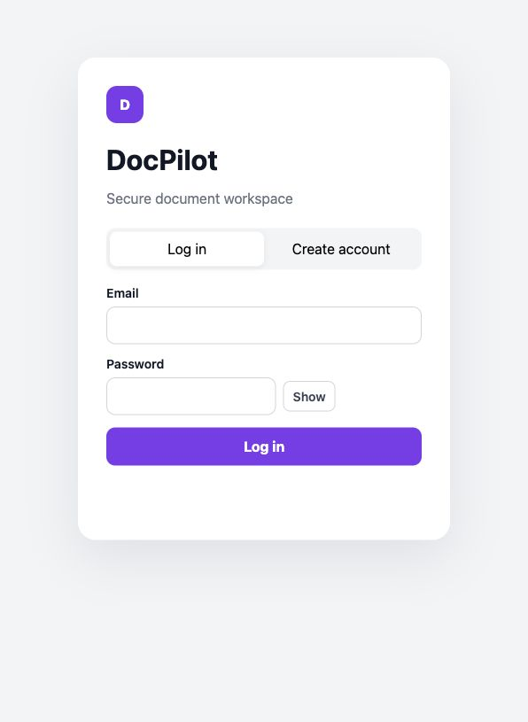
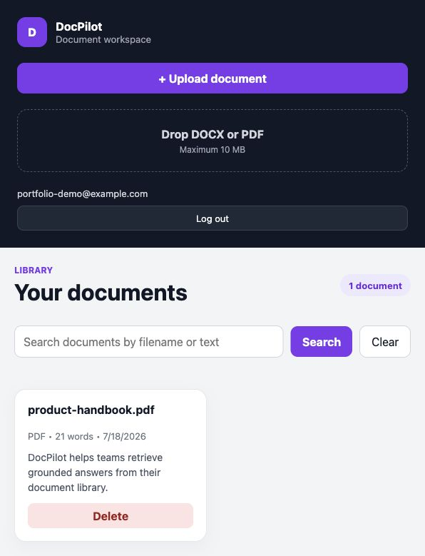
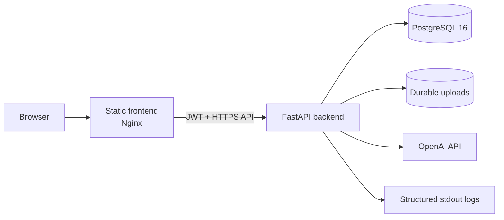
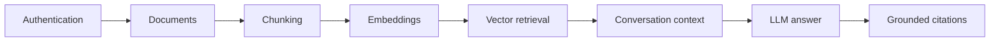
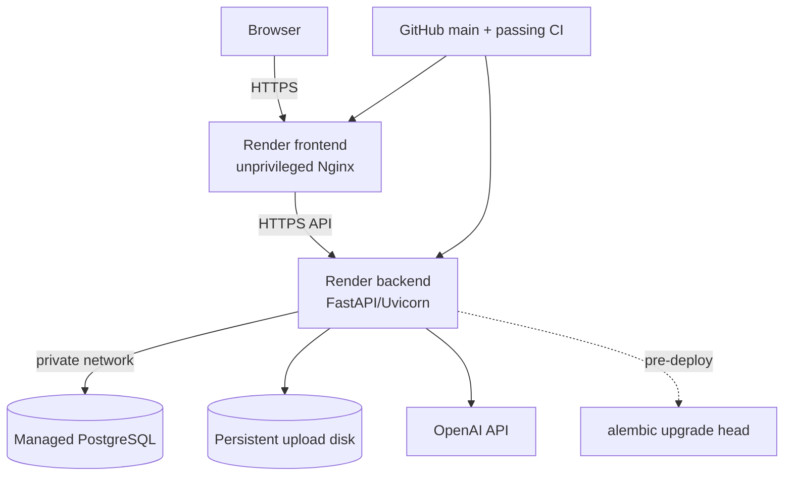

# DocPilot

[](https://github.com/CatalinIA7/docpilot/actions/workflows/ci.yml)
[](LICENSE)

DocPilot is a full-stack document question-answering application. Users upload
PDF or DOCX files, ask natural-language questions, and receive answers grounded
in semantically retrieved passages with source citations.

The project is intentionally small and inspectable: a FastAPI backend, a static
HTML/CSS/JavaScript frontend, PostgreSQL, OpenAI embeddings and generation,
Docker Compose for local operation, and a Render Blueprint for production.

> Deployment status: the production Blueprint and runbook are included, but this
> repository does not claim that a public Render instance is currently running.

## Screenshots

| Sign in | Document library |
| --- | --- |
|  |  |

The screenshots show the real static frontend against an isolated local stack;
the account and document shown were disposable demo data.

## What It Does

- Registers users and authenticates API requests with expiring JWTs.
- Hashes passwords with Argon2 and scopes documents, conversations, and
  evaluations to their owner.
- Accepts PDF and DOCX uploads up to 10 MiB, validates their structure, extracts
  text, and stores source files under generated names.
- Splits documents deterministically while preserving page or paragraph
  metadata, then persists chunks and OpenAI embeddings.
- Embeds every new question, performs semantic retrieval against that user's
  document, and gives only the retrieved context to the language model.
- Validates model-provided source IDs against retrieved chunks before returning
  grounded citations.
- Persists conversation history without replacing retrieval or storing prompt
  internals in message records.
- Compares full-context and RAG evaluation runs across latency, context size,
  retrieval, and citation metrics.
- Emits structured JSON logs with request IDs and timing for HTTP, database,
  retrieval, embedding, generation, uploads, conversations, and migrations.

## Architecture



The central application boundary remains:



Every question performs retrieval. Conversation history supplies bounded
dialogue context; it never replaces document retrieval. See
[the architecture reference](docs/architecture.md) for request, Docker, data,
and production deployment diagrams.

## Technology

| Area | Implementation |
| --- | --- |
| API | FastAPI, Pydantic, Uvicorn |
| Data | SQLAlchemy 2, Alembic, PostgreSQL 16 |
| Authentication | Argon2 password hashing, HS256 JWTs |
| Documents | pypdf, python-docx, deterministic chunker |
| AI | OpenAI embeddings and chat completions |
| Frontend | Static HTML, CSS, and vanilla JavaScript |
| Containers | Docker Compose, non-root Python and Nginx images |
| CI | GitHub Actions |
| Deployment | Render Blueprint, managed PostgreSQL, persistent disk |

The frontend is not a Node project. It has no `package.json`, npm install, or
frontend build step.

## Quick Start

### Prerequisites

- Git
- Docker Desktop, or Docker Engine with the Compose v2 plugin
- An OpenAI API key to upload/embed documents and ask AI-backed questions

### Run from a fresh clone

```bash
git clone https://github.com/CatalinIA7/docpilot.git
cd docpilot
cp .env.example .env
```

Edit `.env` and set at least:

```text
JWT_SECRET_KEY=<a-long-random-development-secret>
OPENAI_API_KEY=<your-provider-key>
```

Then start the complete stack:

```bash
docker compose up --build
```

The one-shot `migrate` service initializes or upgrades PostgreSQL before the
backend starts. When all services are healthy, open
[http://127.0.0.1:5500](http://127.0.0.1:5500).

```bash
docker compose ps
docker compose logs migrate
curl http://127.0.0.1:8000/health
```

Authentication and non-AI reads can run without an OpenAI key. Uploads require
embeddings, so a valid key is required for the normal document workflow. No
provider calls are made by the automated tests.

## Demo Workflow

1. Create an account in the frontend.
2. Upload a small PDF or DOCX file.
3. Open the document and review the extracted text and metadata.
4. Ask a question whose answer appears in the document.
5. Verify the answer includes page- or paragraph-grounded source excerpts.
6. Optionally use the API to create a conversation and send its ID with a
   follow-up question; retrieval still runs while recent messages provide context.
7. Search the library, then delete the demo document when finished.

Development-only OpenAPI docs expose the evaluation endpoints at
[http://127.0.0.1:8000/docs](http://127.0.0.1:8000/docs). Do not run evaluation
against an unapproved provider account.

## Local Service URLs

| Service | URL | Notes |
| --- | --- | --- |
| Frontend | `http://127.0.0.1:5500` | Static Nginx application |
| Backend | `http://127.0.0.1:8000` | FastAPI root |
| API docs | `http://127.0.0.1:8000/docs` | Development only |
| Health | `http://127.0.0.1:8000/health` | Lightweight liveness check |

Change `FRONTEND_PORT` or `BACKEND_PORT` in `.env` if those host ports are busy.

## Configuration

The root `.env.example` is the canonical local template. Do not commit `.env` or
real credentials.

### Core and storage

| Variable | Local default | Purpose |
| --- | --- | --- |
| `JWT_SECRET_KEY` | Required by Compose | Signs access tokens |
| `OPENAI_API_KEY` | Empty | Embeddings and grounded answers |
| `DATABASE_URL` | Built by Compose | SQLAlchemy/Alembic connection URL |
| `POSTGRES_DB` | `docpilot` | Local database name |
| `POSTGRES_USER` | `docpilot` | Local database user |
| `POSTGRES_PASSWORD` | Development value | Local database password |
| `DOCPILOT_UPLOAD_DIR` | `/app/uploads` | Source-document storage |
| `DOCPILOT_API_URL` | `http://127.0.0.1:8000` | Browser-facing backend URL |
| `BACKEND_PORT` / `FRONTEND_PORT` | `8000` / `5500` | Host port mappings |

### Security and request controls

| Variable | Local default | Purpose |
| --- | --- | --- |
| `DOCPILOT_ENVIRONMENT` | `development` | Enables fail-closed production behavior when set to `production` |
| `DOCPILOT_CORS_ORIGINS` | Local frontend origins | Exact browser origins allowed by the API |
| `DOCPILOT_TRUSTED_HOSTS` | Localhost/loopback | Accepted HTTP Host values |
| `DOCPILOT_ACCESS_TOKEN_EXPIRE_MINUTES` | `1440` | JWT lifetime |
| `DOCPILOT_MAX_REQUEST_SIZE` | `11534336` | Declared HTTP body limit in bytes |
| `DOCPILOT_MAX_DOCX_UNCOMPRESSED_SIZE` | `52428800` | DOCX expansion limit |
| `DOCPILOT_MAX_DOCX_ENTRIES` | `2000` | DOCX archive entry limit |
| `DOCPILOT_RATE_LIMIT_ENABLED` | `false` | Enables per-process sensitive-route limits |
| `DOCPILOT_AUTH_RATE_LIMIT_PER_MINUTE` | `20` | Registration/login limit |
| `DOCPILOT_UPLOAD_RATE_LIMIT_PER_MINUTE` | `10` | Upload limit |
| `DOCPILOT_AI_RATE_LIMIT_PER_MINUTE` | `30` | Chat/evaluation provider limit |

### Retrieval, evaluation, and operations

| Variable | Local default | Purpose |
| --- | --- | --- |
| `DOCPILOT_AI_MODEL` | `gpt-4o-mini` | Answer-generation model |
| `DOCPILOT_EMBEDDING_MODEL` | `text-embedding-3-small` | Embedding model |
| `DOCPILOT_EMBEDDING_BATCH_SIZE` | `100` | Upload embedding batch size |
| `DOCPILOT_RETRIEVAL_TOP_K` | `5` | Maximum retrieved chunks |
| `DOCPILOT_RETRIEVAL_MIN_SCORE` | `0.0` | Minimum cosine similarity |
| `DOCPILOT_CONVERSATION_MAX_MESSAGES` | `10` | Recent messages supplied as context |
| `DOCPILOT_EVAL_*` | See `.env.example` | Evaluation thresholds and persistence |
| `DOCPILOT_LOG_LEVEL` | `INFO` | Backend log threshold |
| `DOCPILOT_LOG_FORMAT` | `json` | `json` or local `text` output |
| `DOCPILOT_SLOW_QUERY_MS` | `250` | Slow database-query threshold |
| `DOCPILOT_SERVICE_NAME` | `docpilot-backend` | Structured log service label |

Production requirements and secret sources are documented in the
[Render deployment runbook](docs/deployment-render.md) and
[security model](docs/security.md).

## Database Migrations

Alembic is the schema source of truth. Runtime startup does not call
`Base.metadata.create_all()`; isolated test fixtures are the only remaining
`create_all()` users.

```bash
docker compose run --rm migrate
docker compose run --rm migrate alembic current
docker compose run --rm migrate alembic history
docker compose run --rm migrate alembic check
```

For a non-Docker backend run, activate its virtual environment and run
`alembic upgrade head` from `backend/` before starting Uvicorn.

An existing pre-Alembic database must be backed up and reviewed against the
baseline before it is stamped:

```bash
docker compose up -d db
docker compose build migrate
docker compose run --rm --no-deps migrate alembic stamp 20260718_0001
docker compose run --rm --no-deps migrate alembic check
```

`stamp` records a revision without applying DDL. Never stamp an unverified
schema. Fresh databases should use the normal `alembic upgrade head` path.

## Testing and CI

Run the same backend suite used by CI:

```bash
docker compose run --rm backend pytest
```

Current validated suite: **233 tests**. Focused tests cover authentication,
ownership, documents, chunking, embeddings, retrieval, grounded chat,
conversations, evaluation, observability, migrations, and security boundaries.

Useful pre-PR checks:

```bash
docker compose config
docker compose build backend frontend
docker compose run --rm migrate alembic check
docker compose run --rm backend pytest
git diff --check
```

GitHub Actions runs on pull requests to `main`, pushes to `main`, and manual
dispatch. The two bounded jobs:

- audit pinned Python dependencies, upgrade and drift-check a fresh PostgreSQL
  database, and run all backend tests;
- validate Compose and build the backend and static frontend images.

CI does not call OpenAI, deploy services, publish images, run npm, or use
production secrets.

## Production Deployment

The checked-in `render.yaml` defines two Docker web services, managed PostgreSQL,
an Alembic pre-deploy command, health checks, platform-managed HTTPS and secrets,
and a persistent upload disk.



Applying the Blueprint requires an authorized Render account, billing approval,
production secrets, exact public URLs, and post-deploy verification. Follow the
[deployment runbook](docs/deployment-render.md); configuration in Git is not
evidence of a live deployment.

## Operations and Security

- [Monitoring runbook](docs/monitoring.md): structured event catalog, request-ID
  correlation, health checks, and diagnosis workflows.
- [Security model](docs/security.md): authentication, upload, HTTP, AI/citation,
  dependency, secret, and operator controls.
- [Architecture reference](docs/architecture.md): component boundaries, data
  ownership, request flow, Docker, and production topology.

Production disables API docs, requires a strong JWT secret and exact HTTPS CORS
origins/hosts, enables rate limits, and runs both application images as non-root
users. CI runs `pip-audit` against pinned backend dependencies.

## Design Decisions

- **Static frontend:** no Node toolchain is needed for a small authenticated UI;
  the Docker image packages the assets and Nginx serves them unchanged.
- **Retrieval on every question:** conversation context improves continuity but
  cannot bypass current document retrieval or ownership checks.
- **Grounded citations:** the model suggests source IDs; the backend accepts only
  retrieved IDs and rebuilds citation metadata from database chunks.
- **Alembic before runtime:** migrations fail the deploy before application
  startup instead of mutating schema during import.
- **PostgreSQL plus durable source storage:** relational state and uploaded source
  files have different persistence and recovery needs.
- **Platform-native monitoring:** structured stdout logs and Render health/log
  collection are proportionate to a single-instance portfolio deployment.
- **Simple vector retrieval:** embeddings are persisted as JSON and scored in the
  application, keeping local setup easy at the cost of large-corpus scalability.

## Repository Layout

```text
.
├── backend/                 FastAPI, models, Alembic, AI/retrieval, tests
├── frontend/                Static HTML/CSS/JS and unprivileged Nginx config
├── docs/                    Architecture and production runbooks
├── scripts/                 Shared CI environment setup
├── .github/workflows/       GitHub Actions CI
├── compose.yaml             Local PostgreSQL/backend/frontend topology
└── render.yaml              Production Render Blueprint
```

Detailed module documentation remains beside the backend code for chunking,
conversation history, evaluation, and RAG comparison behavior.

## Data and Lifecycle Commands

```bash
docker compose logs -f backend
docker compose logs migrate
docker compose down
docker compose build --no-cache
```

PostgreSQL uses the `db_data` volume and uploads use `uploads_data`.
`docker compose down` keeps both. The following command is destructive:

```bash
docker compose down -v
```

It deletes local database and upload volumes.

## Known Limitations

- No public deployment is created automatically by cloning the repository.
- The Render persistent disk and in-memory rate limiter assume one backend
  instance; horizontal scaling needs object storage and a shared/edge limiter.
- Embeddings are application-scored JSON vectors rather than a database vector
  index, so retrieval is intended for modest per-document corpora.
- The health endpoint is liveness-only and does not query PostgreSQL or OpenAI.
- There is no password reset, email verification, MFA, refresh-token rotation,
  token revocation, or administrative role model.
- The application does not stream answers, scan files for malware, or provide
  cross-region database/upload recovery.
- Logs have no repository-defined alert destination or independent retention.

## Roadmap

The feature set is complete for the current portfolio scope. Logical scale and
operations follow-ups are object storage, a database vector index, shared rate
limiting, deeper readiness checks, tested backup/restore automation, hosted alert
routing, and a fuller account-recovery lifecycle.

## Contributing and License

See [CONTRIBUTING.md](CONTRIBUTING.md) for the focused branch, validation, and
security-reporting workflow. DocPilot is available under the [MIT License](LICENSE).
