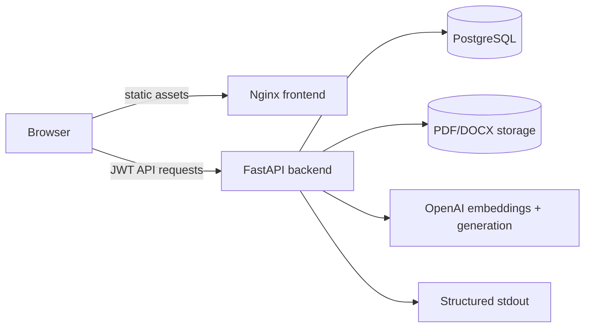
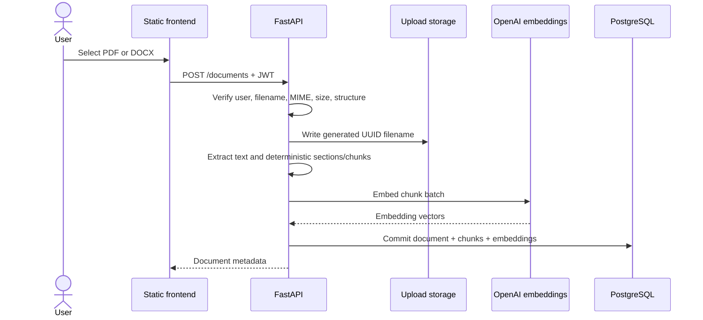
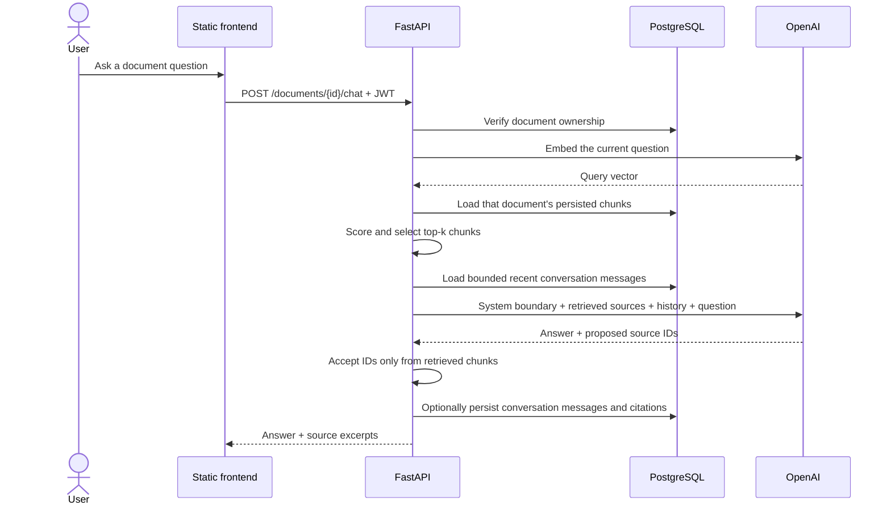
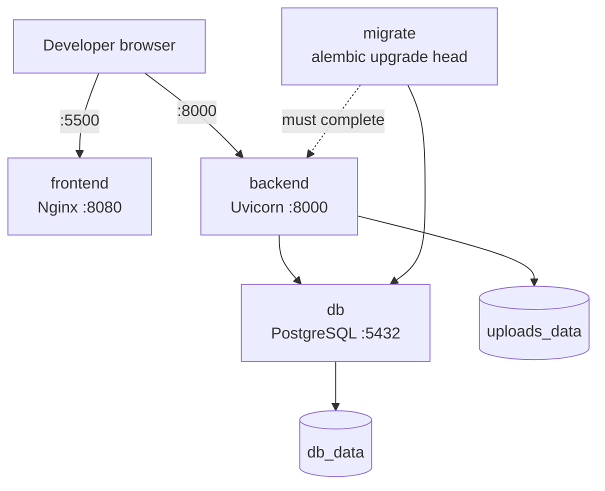
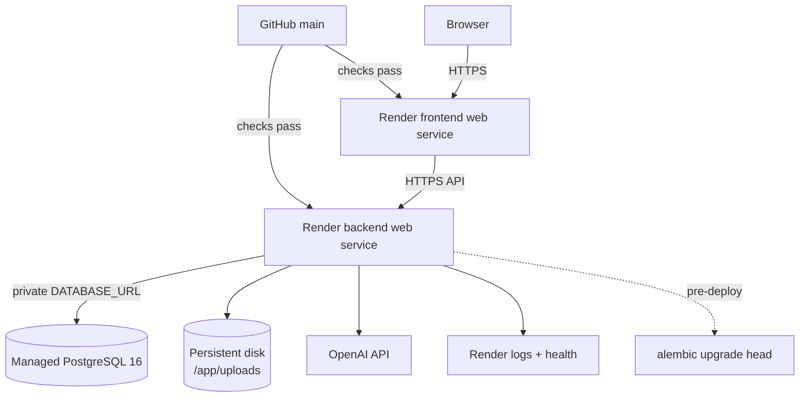

# Architecture Reference

DocPilot is a container-first modular monolith: one FastAPI process owns the
application rules and one static Nginx process serves the browser client. The
boundaries below document the current implementation, not a target redesign.

## System Context

Nginx does not proxy or implement application behavior. It serves the static
frontend and writes the configured public API URL into `config.js` at container
startup. The browser calls FastAPI directly.

## Upload and Indexing Flow

Parsing, chunking, and embedding failures remove the staged source file where
possible. The database commit is transactional, and failures emit structured
events for operator diagnosis.

## Question and Retrieval Flow

The ordering is intentional. Conversation messages are independent of retrieval
internals, and every new question performs retrieval against the owned document.
Message records do not contain embeddings, retrieval scores, or full prompts.

## Data Ownership

| Data | Persistence | Ownership boundary |
| --- | --- | --- |
| Users and password hashes | PostgreSQL | Account identity |
| Document metadata and extracted text | PostgreSQL | `documents.user_id` |
| Source PDF/DOCX files | Upload volume/disk | Generated filename reached through owned document |
| Chunks and embeddings | PostgreSQL | Parent document |
| Conversations and messages | PostgreSQL | User + document |
| Benchmark questions and evaluation records | PostgreSQL | Owned document/run |
| Runtime frontend API URL | Generated `config.js` | Deployment configuration, no secret |

Authorization queries combine the resource identifier with the current user ID.
Cross-user resources return 404 without disclosing that the identifier exists.

## Local Docker Topology

Compose waits for PostgreSQL health, runs the one-shot migration service, then
starts the backend. The frontend waits for backend health. Normal `down` retains
both named volumes; `down -v` deletes them.

## Production Topology

Render terminates HTTPS, injects platform secrets, supplies the database URL and
assigned hostname, and mounts durable upload storage. The persistent disk makes
the current backend a single-instance design. See `deployment-render.md` before
applying the Blueprint.

## Runtime Boundaries

- `auth.py` and authentication routes own password and token behavior.
- document routes own file validation, extraction, chunk creation, persistence,
  ownership checks, search, and deletion.
- embedding and retrieval services own provider calls and similarity scoring.
- chat routes orchestrate retrieval, bounded conversation context, grounded
  generation, citation validation, and message persistence.
- evaluation modules run baseline/RAG comparisons without altering production
  chat behavior.
- observability and security middleware wrap the HTTP boundary without storing
  prompts, credentials, document text, or SQL.
- Alembic owns production schema creation and upgrades; application startup does
  not create tables.

## Deliberate Tradeoffs

The static frontend avoids a Node build toolchain. JSON embeddings and in-process
cosine scoring avoid a vector extension for modest document collections. A
persistent platform disk is simpler than object storage for one instance.
Structured platform-collected logs avoid operating a monitoring stack. Each
choice has an explicit scale limit documented in the README and runbooks.
